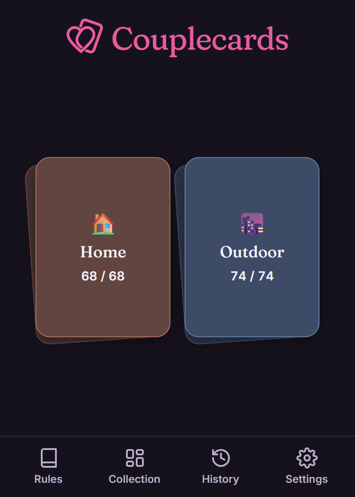
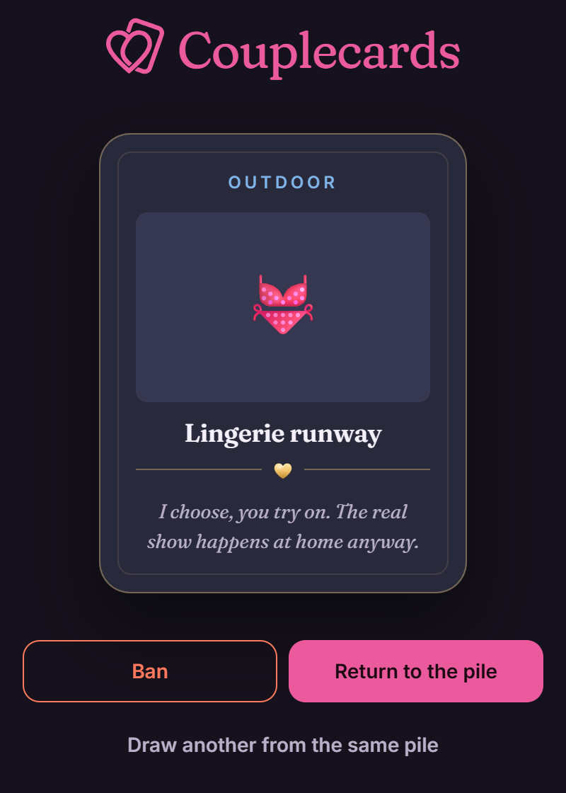

# Couplecards

[](./LICENSE)
[](https://github.com/qiaeru/couplecards/releases)
[](https://github.com/qiaeru/couplecards/pkgs/container/couplecards)
[](https://github.com/qiaeru/couplecards/stargazers)

A self-hosted web app that lets couples draw activity cards to break the routine and spice up their daily lives.

The deck is split into two piles, "Home" and "Outdoor". Each instance has one administrator and as many player accounts as you want. The admin can create accounts directly, or open public registration so anyone can sign up from the login page. In practice a couple often shares a single account.

The app works offline once loaded.

> **Self-hosted, your call on sign-ups.** Start it, sign in, then create accounts or open public registration from the admin panel. There is no telemetry and no external network call at runtime.

## Try the demo

A hosted demo is available at **<https://couplecards.qiaeru.com/>**. Sign in with `demo` / `demo`. The demo account's state is wiped on every sign-in, so feel free to click anything.

| Home | Reveal |
| :--: | :--: |
|  |  |
| *The two piles on the home screen* | *A card revealed from the deck* |

## Highlights

### What it does

- **Two piles, one ritual.** The deck splits into a "Home" pile and an "Outdoor" pile. Tap a pile, the top card flips with a foil-shimmer reveal, and a swipe sends it back to the deck or bans it from future draws.
- **Personal deck memory.** Each player gets their own history, their own ban list, and a low-pile warning when a stack runs thin. Banned cards can be restored with one tap. Drawing a second time from the same pile returns the previous card so the deck stays balanced.
- **Accounts your way.** The built-in admin creates accounts for each player, or opens public registration so people sign up themselves from the login page. The admin also manages the shared card library (create, edit, ban, export, import, sync from JSON), sets the activity language, and can sweep away accounts left inactive for months. No third-party identity provider.
- **Responsive PWA, five languages.** French, English, German, Italian, and Spanish all ship out of the box. Works on phone, tablet, and desktop with a dark theme, a foil-and-glow visual language, full keyboard and screen-reader support, install-to-home-screen on iOS and Android, and offline use after the first load.

### Under the hood

- **Backend.** Node.js 24 and Fastify 5, with SQLite through the built-in `node:sqlite` module. The entire database is a single file on disk (`var/couplecards.db`). Password hashing uses `hash-wasm` (pure WebAssembly), so the server has zero native dependencies and no compilation step.
- **Authentication.** Argon2id password hashes, session cookies flagged `HttpOnly` and `SameSite=Strict`, CSRF protection, per-route rate limiting, account lockout after repeated failures, and a forced password change on first sign-in for admin-created accounts.
- **Frontend.** Vanilla ES modules organized into `core`, `features`, and `ui`. No client-side build step is required to edit a feature. Two vendor bundles produced by esbuild during the Docker build (zxcvbn for password strength, fflate for the deck export/import) are the only artifacts that need a build step.
- **Offline first.** IndexedDB caches the deck, an outbox replays mutations on reconnect, and a Service Worker precaches the app shell so the app still opens with no network.
- **Internationalized.** Five locales ship out of the box (French is the source of truth, English is the fallback, German, Italian, and Spanish are full naturalizations). Every user-facing string lives in `public/locales/<locale>.json`. The bundled fonts (Inter and Fraunces) cover Latin Extended and Vietnamese; Greek and Cyrillic fall back to Georgia / system serif.
- **Ready for public release.** MIT licensed, no CDN, no analytics, strict CSP, `X-Robots-Tag: noindex`, SPDX headers on every source file, `security.txt`, Dependabot, GitHub Actions CI, and GHCR releases.

## Quick start

```bash
cp .env.example .env
# Generate a secret with: openssl rand -base64 48
# Paste it into .env as SESSION_SECRET
docker compose up -d --build
```

Open <http://localhost:3000>. On the first boot:

1. Sign in with `couplecards` and the password `changeme`.
2. Pick a strong admin password when prompted.
3. From the admin panel, create accounts for the players, or open public registration so they can sign up themselves from the login page. Admin-created accounts show their initial password exactly once; copy it somewhere safe.

## Documentation

- [Deployment guide](./docs/deployment.md) covers environment variables, volumes, backups, emergency reset and the GHCR image.
- [Admin guide](./docs/administration.md) explains user and card management, the deck maintenance tools, and the role model.
- [Configuration reference](./docs/configuration.md) lists every environment variable.
- [Security model](./docs/security.md) details the threat model and hardening choices.
- [Architecture](./docs/architecture.md) describes how the backend and frontend fit together.
- [Internationalization](./docs/i18n.md) walks through adding a new language.
- [Accessibility](./docs/accessibility.md) tracks the checklist and audit results.
- [Contributing](./CONTRIBUTING.md) describes the contributor workflow.
- [Changelog](./CHANGELOG.md) tracks released versions.

## HTTPS deployments

Three ready-to-use Compose variants live in [`deploy/`](./deploy/):

- [Caddy](./deploy/caddy/README.md) is the simplest option, with automatic Let's Encrypt certificates.
- [Traefik](./deploy/traefik/README.md) uses label-based routing and fits well alongside other services.
- [nginx](./deploy/nginx/README.md) is for hosts that already run nginx with their own certbot pipeline.

## Credits

Every third-party asset ships locally under a permissive open-source license. The project uses the Inter and Fraunces fonts (SIL OFL 1.1), the Fluent UI Emoji icon set (MIT), Fastify, hash-wasm, zxcvbn-ts and esbuild. See [CREDITS.md](./CREDITS.md) for the full attribution list.

## License

Released under the MIT License. See [LICENSE](./LICENSE) for the full text.
