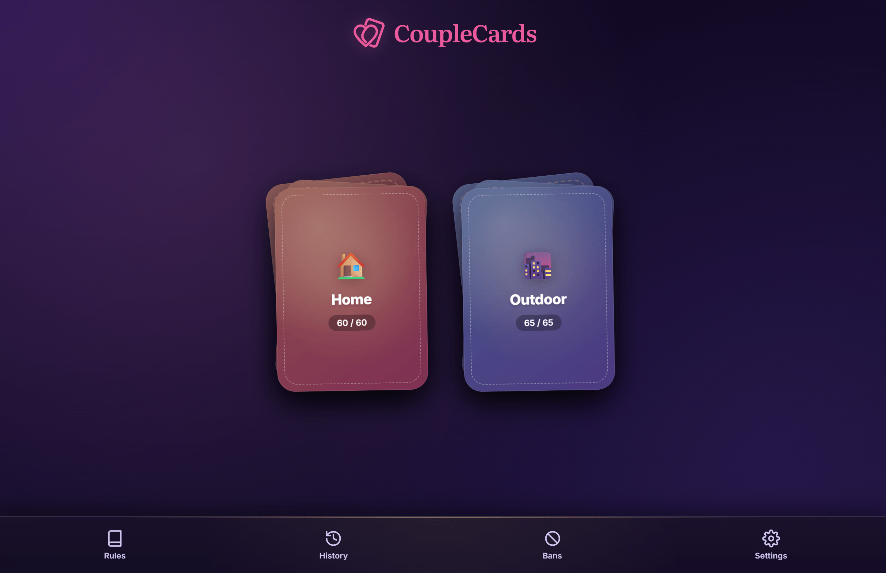
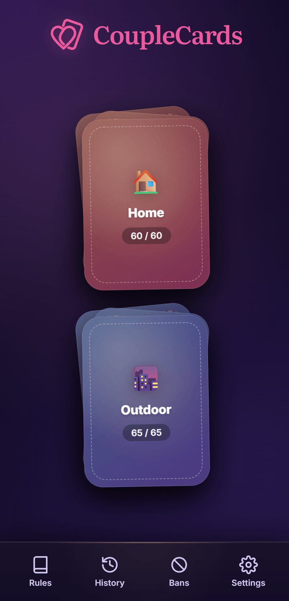

# CoupleCards

[](./LICENSE)
[](https://github.com/qiaeru/couplecards/releases)
[](https://github.com/qiaeru/couplecards/pkgs/container/couplecards)
[](https://github.com/qiaeru/couplecards/stargazers)

A self-hosted web app that lets couples draw activity cards to break the routine and spice up their daily lives.

The deck is split into two piles, "Home" and "Outdoor". Each instance hosts a dedicated administrator plus as many user accounts as the couple needs, and account management stays entirely in the admin's hands.

The app is fully offline-capable once loaded.

> **One Docker instance, one couple.** Start it, sign in, then invite both partners. There is no telemetry and no external network call at runtime.

## Try the demo

A hosted demo is available at **<https://couplecards.qiaeru.com/>**. Sign in with `demo` / `demo`. The demo account's state is wiped on every sign-in, so feel free to click anything.





## Highlights

- **Backend.** Node.js 24 and Fastify 5, with SQLite through the built-in `node:sqlite` module. The entire database is a single file on disk (`var/couplecards.db`). Password hashing uses `hash-wasm` (pure WebAssembly), so the server has zero native dependencies and no compilation step.
- **Authentication.** Argon2id password hashes, session cookies flagged `HttpOnly` and `SameSite=Strict`, CSRF protection, per-route rate limiting, account lockout after repeated failures, and a forced password change on first sign-in.
- **Frontend.** Vanilla ES modules organised into `core`, `features` and `ui`. No client-side build step is required to edit a feature. The only bundled asset is the zxcvbn vendor script, produced by esbuild during the Docker build.
- **Offline first.** IndexedDB caches the deck, an outbox replays mutations on reconnect, and a Service Worker serves the shell with a stale-while-revalidate strategy for the card list.
- **Internationalised.** English and French ship out of the box, with English as the fallback. Every user-facing string lives in `public/locales/{en,fr}.json`. The bundled fonts (Inter and Literata) cover Latin extended, Cyrillic, Greek and Vietnamese.
- **Ready for public release.** MIT licensed, no CDN, no analytics, strict CSP, `X-Robots-Tag: noindex`, SPDX headers on every source file, `security.txt`, Dependabot, GitHub Actions CI, and GHCR releases.

## Quick start

```bash
cp .env.example .env
# Generate a secret with: openssl rand -base64 48
# Paste it into .env as SESSION_SECRET
docker compose up -d --build
```

Open <http://localhost:3000>. On the first boot:

1. Sign in with `couplecards` and the password `changeme`.
2. Pick a strong admin password when prompted.
3. From the admin panel, create one user account per player. The initial password for each is shown exactly once; copy it somewhere safe.

## Documentation

- [Deployment guide](./docs/deployment.md) covers environment variables, volumes, backups, emergency reset and the GHCR image.
- [Admin guide](./docs/administration.md) explains user and card management, the deck maintenance tools, and the role model.
- [Configuration reference](./docs/configuration.md) lists every environment variable.
- [Security model](./docs/security.md) details the threat model and hardening choices.
- [Architecture](./docs/architecture.md) describes how the backend and frontend fit together.
- [Internationalisation](./docs/i18n.md) walks through adding a new language.
- [Accessibility](./docs/accessibility.md) tracks the checklist and audit results.
- [Contributing](./CONTRIBUTING.md) describes the contributor workflow.
- [Changelog](./CHANGELOG.md) tracks released versions.

## HTTPS deployments

Three ready-to-use Compose variants live in [`deploy/`](./deploy/):

- [Caddy](./deploy/caddy/README.md) is the simplest option, with automatic Let's Encrypt certificates.
- [Traefik](./deploy/traefik/README.md) uses label-based routing and fits well alongside other services.
- [nginx](./deploy/nginx/README.md) is for hosts that already run nginx with their own certbot pipeline.

## Credits

Every third-party asset ships locally under a permissive open-source licence. The project uses the Inter and Literata fonts (SIL OFL 1.1), the Fluent UI Emoji icon set (MIT), Fastify, hash-wasm, zxcvbn-ts and esbuild. See [CREDITS.md](./CREDITS.md) for the full attribution list.

## License

Released under the MIT License. See [LICENSE](./LICENSE) for the full text.
